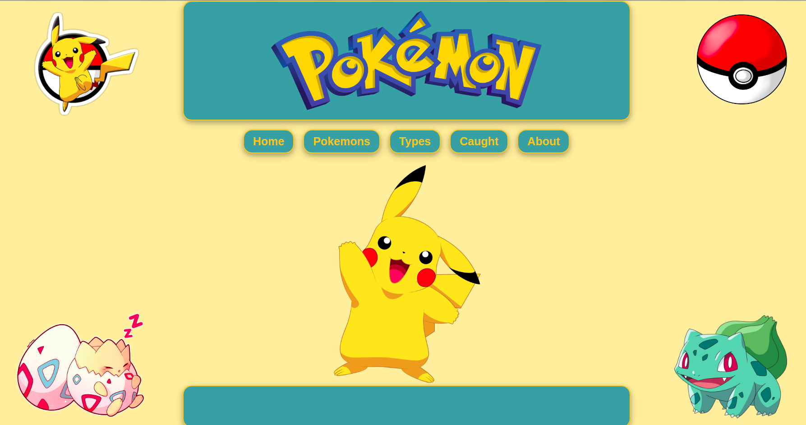
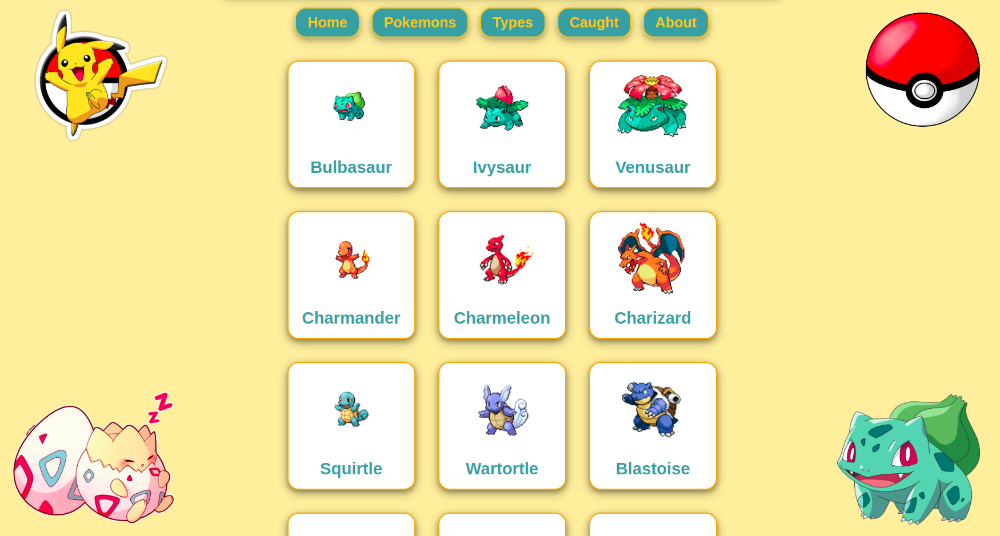
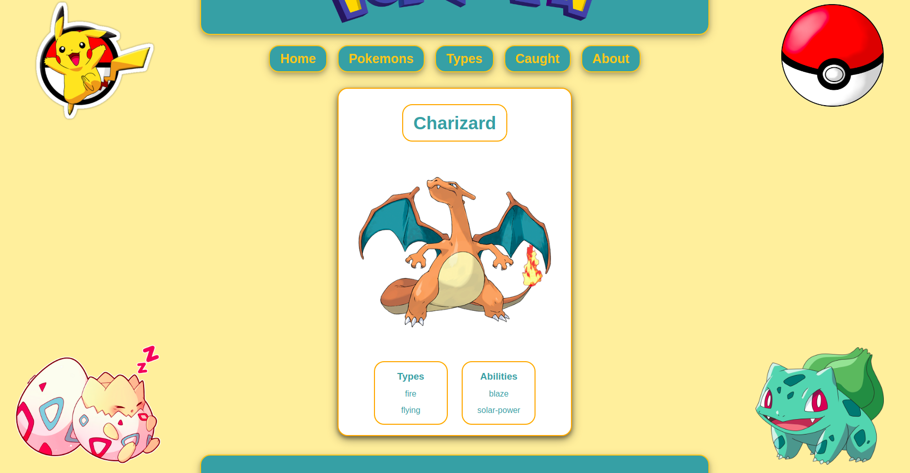
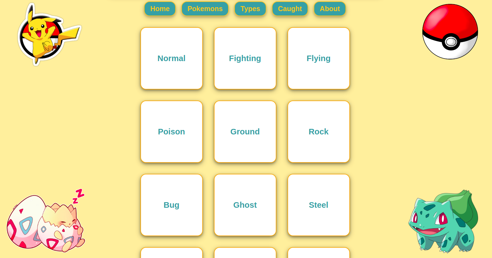
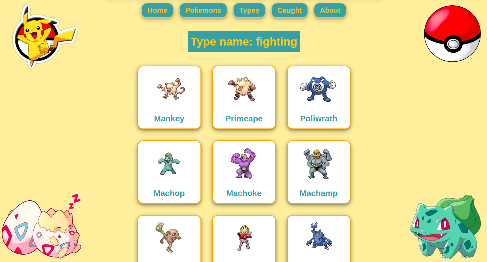
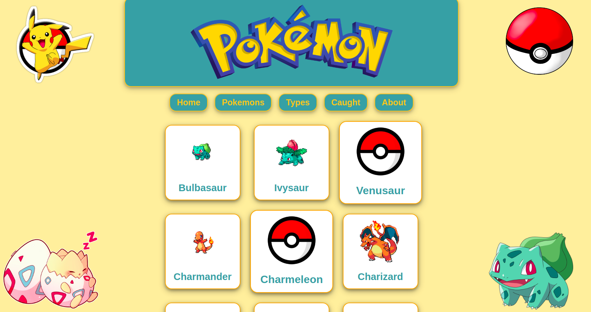
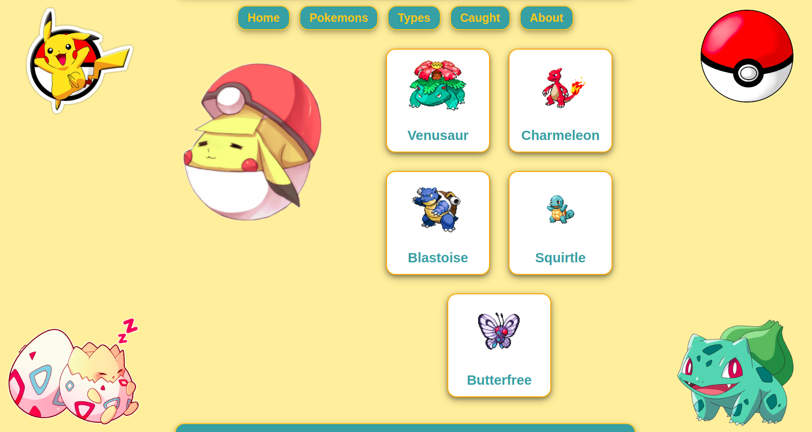

# Reactomon

## About the project

Reactomon is a simple React frontend SPA without backend.
The purpose of the project is to learn React in a fun way.
The theme of the app is Pokemon and I use axios to fetch data from the PokeAPI (https://pokeapi.co/docs/v2).

- I use StyledComponents for styling
- I use axios for fetching data from the API
- I use React context for persisting user data through pages
- I use drag n drop to "catch" pokemons

### Requirements / installation

- As package manager `npm` is required.
- Dependencies are included in the `package.json` file.
- After cloning the project, dependencies can be installed with `npm install` command.
- For info about how to run the project with npm please see the description below. 

### Main features

#### 1. Main page
Contains a header with navbar and a draggable pokeball in the top right corner.

#### 2. Pokemons page
Also contains a list of all the pokemon cards fetched from the PokeAPI.
There are 20 pokemon cards in one page and pagination is implemented.
Cards' size grows when the ball is dragged over.

#### 3. Pokemon details
When clicking on a pokemon card, we can check the pokemon details on a bigger card.

#### 4. Types page
On types page all the pokemon types are listed which are available on the api.

#### 5. Pokemons listed by type
When clicking on a type on types page all the pokemons are listed which belong to that type.

#### 6. Catching pokemons
On both the pokemons page and the pokemons list by type page we can drag the pokeball over the pokemon cards to catch a pokemon.
When the ball is dropped on a card, the picture changes to a closed pokeball.

#### 7. Caught pokemons
On the caught page we can se all the pokemons which we have caught already.

As this is an SPA without a backend and database, all the action is on the client side and data is only saved into the React context.
Therefore, when the page is refreshed, everything defaults back to the original state.

##  Guide to setting up a React app

This project was bootstrapped with [Create React App](https://github.com/facebook/create-react-app).

## Available Scripts

In the project directory, you can run:

### `npm start`

Runs the app in the development mode.\
Open [http://localhost:3000](http://localhost:3000) to view it in the browser.

The page will reload if you make edits.\
You will also see any lint errors in the console.

### `npm test`

Launches the test runner in the interactive watch mode.\
See the section about [running tests](https://facebook.github.io/create-react-app/docs/running-tests) for more information.

### `npm run build`

Builds the app for production to the `build` folder.\
It correctly bundles React in production mode and optimizes the build for the best performance.

The build is minified and the filenames include the hashes.\
Your app is ready to be deployed!

See the section about [deployment](https://facebook.github.io/create-react-app/docs/deployment) for more information.

### `npm run eject`

**Note: this is a one-way operation. Once you `eject`, you can’t go back!**

If you aren’t satisfied with the build tool and configuration choices, you can `eject` at any time. This command will remove the single build dependency from your project.

Instead, it will copy all the configuration files and the transitive dependencies (webpack, Babel, ESLint, etc) right into your project so you have full control over them. All of the commands except `eject` will still work, but they will point to the copied scripts so you can tweak them. At this point you’re on your own.

You don’t have to ever use `eject`. The curated feature set is suitable for small and middle deployments, and you shouldn’t feel obligated to use this feature. However we understand that this tool wouldn’t be useful if you couldn’t customize it when you are ready for it.

## Learn More

You can learn more in the [Create React App documentation](https://facebook.github.io/create-react-app/docs/getting-started).

To learn React, check out the [React documentation](https://reactjs.org/).

### Code Splitting

This section has moved here: [https://facebook.github.io/create-react-app/docs/code-splitting](https://facebook.github.io/create-react-app/docs/code-splitting)

### Analyzing the Bundle Size

This section has moved here: [https://facebook.github.io/create-react-app/docs/analyzing-the-bundle-size](https://facebook.github.io/create-react-app/docs/analyzing-the-bundle-size)

### Making a Progressive Web App

This section has moved here: [https://facebook.github.io/create-react-app/docs/making-a-progressive-web-app](https://facebook.github.io/create-react-app/docs/making-a-progressive-web-app)

### Advanced Configuration

This section has moved here: [https://facebook.github.io/create-react-app/docs/advanced-configuration](https://facebook.github.io/create-react-app/docs/advanced-configuration)

### Deployment

This section has moved here: [https://facebook.github.io/create-react-app/docs/deployment](https://facebook.github.io/create-react-app/docs/deployment)

### `npm run build` fails to minify

This section has moved here: [https://facebook.github.io/create-react-app/docs/troubleshooting#npm-run-build-fails-to-minify](https://facebook.github.io/create-react-app/docs/troubleshooting#npm-run-build-fails-to-minify)
